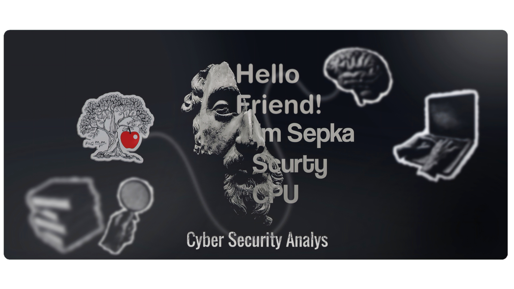

#  Halo, Saya sepkascurty-cpu!
###  Cybersecurity Enthusiast | Python Developer | Linux Learner

  

---

### Siapa Saya? 

Saya adalah pelajar dan praktisi di bidang Keamanan Siber dengan minat kuat pada analisis sistem, eksplorasi kerentanan, dan pemahaman cara kerja ancaman digital. Ketertarikan saya terhadap cybersecurity tumbuh dari rasa ingin tahu yang tinggi tentang bagaimana sebuah sistem dapat diserang, dipertahankan, dan diaudit secara teknis.
Saya terbiasa bekerja di lingkungan Linux, mempelajari dasar hingga menengah jaringan komputer, serta mengembangkan alat bantu keamanan berbasis Python untuk kebutuhan analisis, otomasi, dan OSINT.
Fokus utama saya bukan sekadar menggunakan tools, tetapi membangun pola pikir seorang security analyst — analitis, sistematis, dan berbasis risiko.
#### Fokus Pembelajaran & Pengembangan
- Memahami pola serangan dan kelemahan sistem
- Membangun tools sederhana namun fungsional
- Melakukan analisis teknis dan dokumentasi secara terstruktur

###  Repositori ini merupakan representasi dari perjalanan belajar dan eksplorasi saya di bidang keamanan siber, sekaligus komitmen saya untuk terus berkembang secara teknis dan profesional.

---

###  Koleksi Proyek Keamanan Siber
Berikut adalah daftar alat dan riset yang saya kembangkan untuk eksplorasi keamanan siber:

####  [RMA - Android Security](https://github.com/sepkascurty-cpu/RMA)
Framework manajemen risiko dan analisis malware untuk ekosistem Android.
- **Fitur:** APK Analysis, RAT Detector, & Security Monitoring.
- **Status:** Active Research

####  [SHADW-R (SHADOW-RECON)](https://github.com/sepkascurty-cpu/SHADW-R)
Advanced OSINT Framework untuk pelacakan jejak digital (Digital Footprinting).
- **Fitur:** Username, Email, & Phone Lookup, Multi-threading, & JSON Reporting.
- **Status:** Stable Release 

####  [BLEV-SCANNER](https://github.com/sepkascurty-cpu/blev-scanner)
Advanced Multi-Protocol Bruteforcer & Framework Scanner.
- **Fitur:** 5+ Protocol Support, High-speed Threading, & Integrated Port Scanning.
- **Highlight:** Dibuat dengan sistem modular untuk efisiensi reconnaissance dan audit kredensial.
- **Status:** Stable Release 

####  [XCP-XSS-PRO](https://github.com/sepkascurty-cpu/xcp-xss-pro)
Professional Cross-Site Scripting (XSS) Vulnerability Scanner.
- **Fitur:** Advanced Payload Injection, HTML/JSON Reporting, & Custom Configurations.
- **Highlight:** Dirancang untuk otomasi pengujian celah keamanan pada input web.
- **Status:** Stable Release 

####  [PX-SUITE](https://github.com/sepkascurty-cpu/PX-SUITEe)
Toolkit reconnaissance all-in-one untuk pengumpulan informasi target.
- **Fitur:** Port Scanning, Banner Grabbing, & Directory Buster.
- **Status:** Active Development 

####  [Network ARP Scanner](https://github.com/sepkascurty-cpu/network-scanner-porto)
Script pemetaan jaringan lokal untuk mendeteksi perangkat aktif.
- **Teknik:** ARP Request Broadcaster.
- **Kegunaan:** Network Monitoring & Discovery.

####  [Simple File Encryptor](https://github.com/sepkascurty-cpu/file-encryptor-porto)
Implementasi algoritma AES-256 untuk perlindungan integritas data.
- **Fokus:** Kriptografi & Data Privacy.
- **Keamanan:** Military-grade encryption standard.

####  [PXSCAN](https://github.com/sepkascurty-cpu/PXSCAN)
Alat scanning port yang lebih komprehensif untuk mendeteksi celah keamanan pada server.
- **Status:** Proyek Pertama 

---

###  Professional Skill-Set & Weaponry

####  Offensive Security & Pentesting

  
  
  
  
  

####  Security Development (Python)

  
  
  
  
  

####  Web & Network Defense

  
  
  
  

####  Core Infrastructure

  
  
  
  
  

### Cybersecurity & Offensive Operations

  
  
  
  
  

### Artificial Intelligence & Automation

  
  
  
  

### Programming & Infrastructure

  
  
  
  
  

###  Artificial Intelligence & Data Intelligence

  
  
  
  
  
  
  
  
  

---

###  Statistik Aktivitas GitHub

  

  
  
  
  

---

### Contribution Snake

  

  <i>"Don't just code, make it an art."</i>

